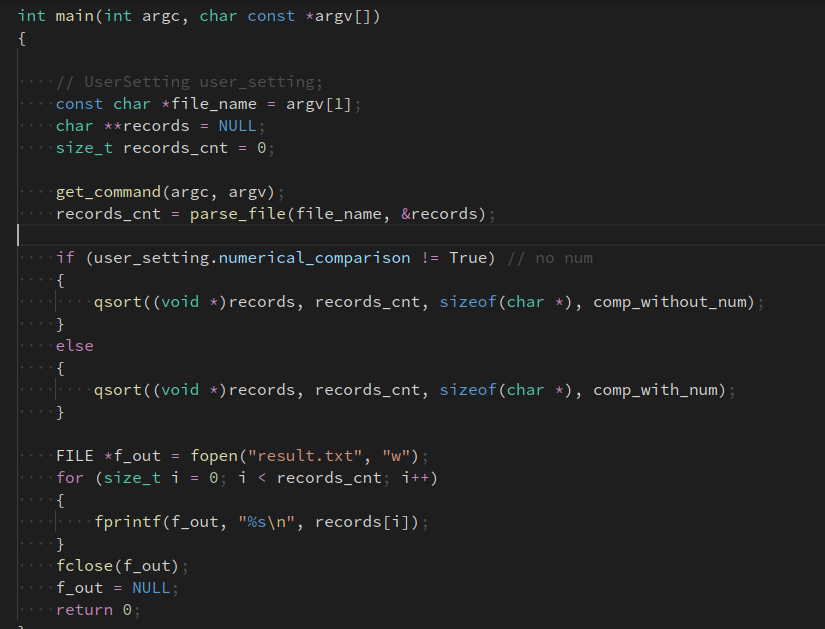

# Data Engineering Hw1-1

---

## Enviroment

- Virtual Box
- OS : Ubuntu 16.04 LTS 64 bits
- CPU: AMD Ryzen 5 1600
- Memory: 8G

## Commnad

```bash
./main file_name -d delimiter (Need) | -k key_pat (need) | -c case_insensitive | -r: reverse_order | -n: numerical_comparison
```

- -d: record_delimiter (need)
- -k: key_pat (need)
- -c: case insensitive
- -r: reverse order
- -n: numerical comparison

## Preprocess

- 把作業給的 ettoday 新聞檔們合成一個 ettoday_full.rec

```bash
cat ettoday0.rec ettoday1.rec ettoday2.rec ettoday3.rec ettoday4.rec ettoday5.rec > ettoday_full.rec
```

- 英文單字集


- 數字集

隨機生成一萬個數值介於 0 到 10000 的正整數


## Compile

```bash
make
```

## Implement

挑比較重要的來說明

### main function

驅動讀取指令(get_command)、讀檔、分割區塊(parse_file)、排序、輸出檔案等功能



### 分割功能

這個功能我其實不太了解，我就把它當作以 -d 的 pattern 來做切割點，
但是 `strtok()` 裡面是字串的話是以該字串的字元當作切割點。

像是 `strtok(an)` 他不是以 " an " 來切割，而是以 "a" 和 "n" 來切。

程式碼部份太多了不上圖了。

### Sort

這裡使用的是 C 語言內建的 `qsort`


### Compare function

compare function 我分成 2 個部份

1. 數值比較
   int comp_with_num(const void *a, const void *b)

2. 字串比較
   int comp_with_str(const void *a, const void *b)

## 結果

Sort 花費時間使用 `<time.h>` 的 `clock()`

1. 排序數字（非數值）

   - 時間
     
   - 結果
     

2. 排序數字（數值）

   - 時間
     
   - 結果
     

3. 英文單字：
   這個是測試 `-c` 的測資

   - 時間
     
   - 結果
     

4. 新聞：
   - 時間
     
   - 結果
     

## 結論

數字字串排序與數值排序結果是有所差別的
